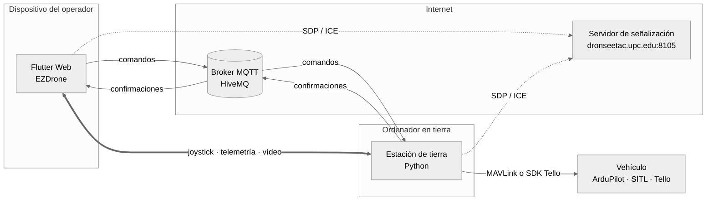
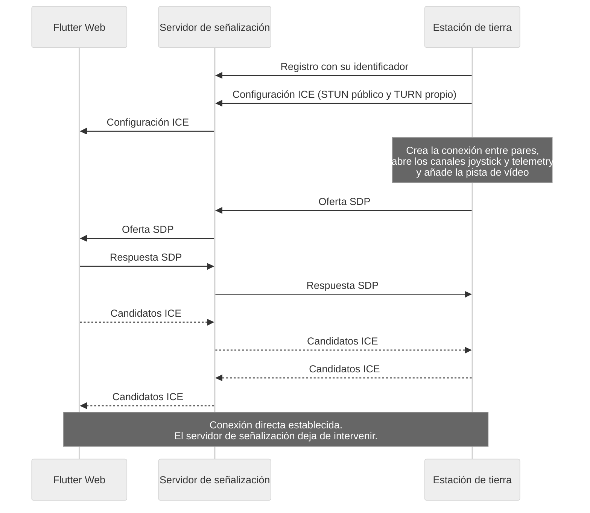
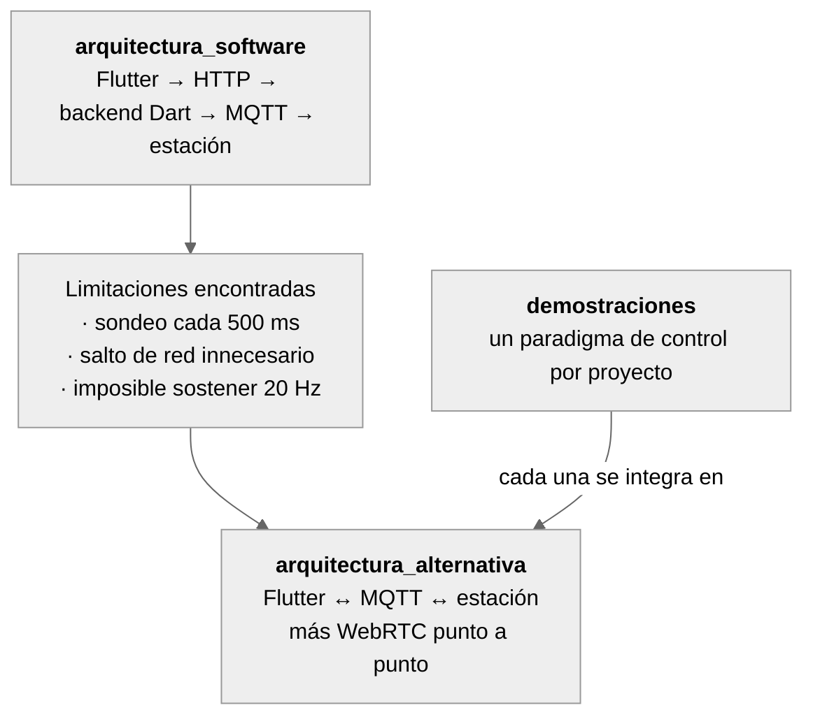
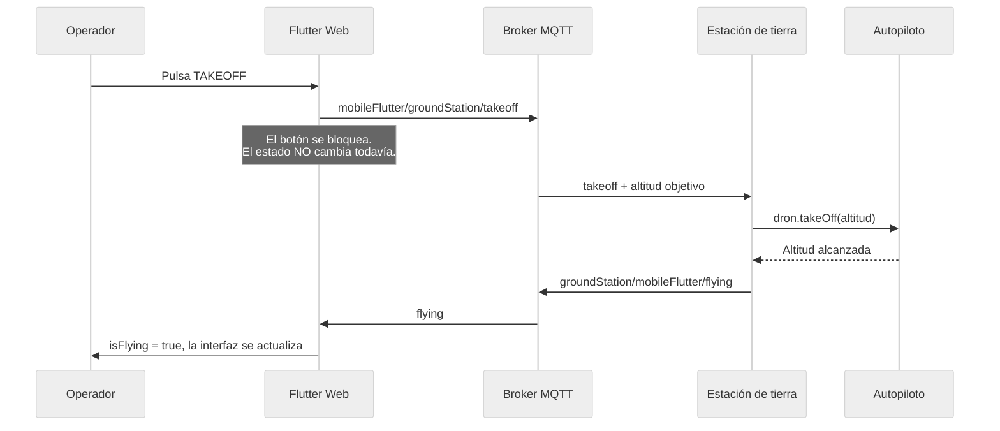
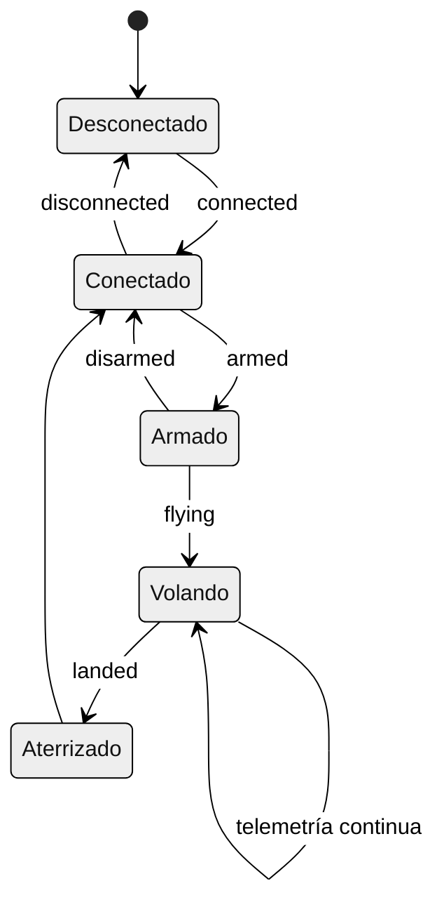
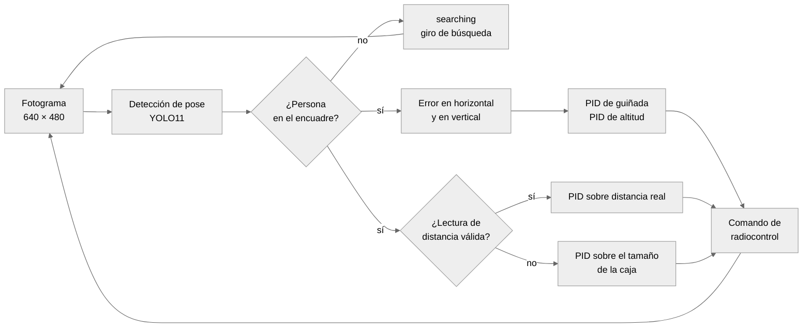
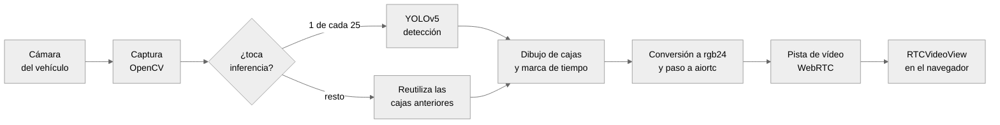

[README.md](https://github.com/user-attachments/files/31599984/README.md)
<div align="center">

# EZDrone

### Estación de control de drones que se ejecuta en el navegador

Pilotaje de vehículos ArduPilot y DJI Tello desde cualquier dispositivo con navegador,
sin instalar nada, con vídeo en directo, detección de objetos y modos de vuelo autónomo.

Flutter Web · Dart · Python · MAVLink · WebRTC · MQTT

**Trabajo de Fin de Grado** · Dídac Bosch Garcias
Grado en Ingeniería de Sistemas Aeroespaciales · EETAC

<br>

<a href="https://youtu.be/yD2p1JXpO5w">
  
</a>

<sub><b>Demostración completa</b> — la aplicación final en funcionamiento con el simulador SITL,<br>el Hexsoon EDU-450, el DJI Tello y un dispositivo Android</sub>

</div>

---

## Qué es esto

Las estaciones de control de drones de código abierto —Mission Planner,
QGroundControl y las ocho o nueve alternativas que documenta ArduPilot— comparten
una limitación: **ninguna se despliega en web**. Todas exigen instalación local, y
la mayoría están atadas a un sistema operativo concreto. Para un operador que
quiera conectarse desde el móvil, o para un aula donde cada estudiante trae un
portátil distinto, eso es una barrera real.

EZDrone cubre ese hueco. Es una estación de control que se sirve como ficheros
estáticos y se abre en cualquier navegador, incluido el del teléfono. Y como
corre en el navegador, puede apoyarse en sensores y APIs que una aplicación de
escritorio no tiene a mano: el micrófono para el control por voz, la unidad
inercial del móvil para pilotar inclinando el dispositivo, y el GPS del propio
dispositivo para situar al operador en el mapa.

El repositorio contiene, además, **ocho demostraciones Flutter independientes**,
una por paradigma de control, escritas para ser leídas y reutilizadas por quien
continúe el trabajo.

### Lo que hace

- **Tres vehículos** desde la misma interfaz: Hexsoon EDU-450 con Pixhawk y
  ArduPilot, el simulador SITL, y un DJI Tello.
- **Tres formas de pilotar**: joysticks virtuales, comandos de voz, e inclinación
  del dispositivo.
- **Vídeo en directo** con detección de objetos superpuesta, captura de
  fotografías y grabación, todo dentro del navegador.
- **Misiones autónomas** por waypoints, dibujadas sobre el mapa, con acciones por
  punto y exportación al formato de Mission Planner.
- **Modos autónomos del Tello**: seguimiento de personas por visión y sensor de
  distancia, órbita alrededor de un objetivo y panorámica de 360 grados.
- **Registro de vuelos** persistente, con reproducción temporal de la telemetría
  sobre el mapa y exportación a CSV.

---

## Índice

- [Explicación del código en vídeo](#explicación-del-código-en-vídeo)
- [Arquitectura](#arquitectura)
  - [Reparto de canales](#reparto-de-canales)
  - [Cómo se establece la conexión directa](#cómo-se-establece-la-conexión-directa)
  - [Decisiones de diseño](#decisiones-de-diseño)
  - [Cómo se llegó hasta aquí](#cómo-se-llegó-hasta-aquí)
- [Estructura del repositorio](#estructura-del-repositorio)
- [Cómo funciona](#cómo-funciona)
  - [El recorrido de un comando](#el-recorrido-de-un-comando)
  - [Máquina de estados del vuelo](#máquina-de-estados-del-vuelo)
  - [Gestión de estado en el frontend](#gestión-de-estado-en-el-frontend)
  - [Modos de control](#modos-de-control)
- [Vuelo autónomo](#vuelo-autónomo)
- [Pipeline de vídeo](#pipeline-de-vídeo)
- [Demostraciones](#demostraciones)
- [Puesta en marcha](#puesta-en-marcha)
- [Referencia de la interfaz de comunicación](#referencia-de-la-interfaz-de-comunicación)
- [Solución de problemas](#solución-de-problemas)
- [Limitaciones conocidas](#limitaciones-conocidas)
- [Trabajo futuro](#trabajo-futuro)
- [Stack tecnológico](#stack-tecnológico)
- [Contexto académico](#contexto-académico)

---

## Explicación del código en vídeo

Estos seis vídeos recorren la implementación en detalle, de la arquitectura general
al bucle de control autónomo. El código está comentado, pero si vas a partir de
este trabajo, verlos ahorra bastante tiempo de lectura.

<div align="center">
<table>
<tr>
<td align="center" width="270">
  <a href="https://youtu.be/luTartOLnpY"></a><br>
  <sub><b>1 · Arquitectura y comunicaciones</b><br>El reparto entre MQTT y WebRTC</sub>
</td>
<td align="center" width="270">
  <a href="https://youtu.be/wXS3vm1yX-4"></a><br>
  <sub><b>2A · El núcleo del frontend</b><br><code>DronProvider</code>, MQTT y WebRTC</sub>
</td>
<td align="center" width="270">
  <a href="https://youtu.be/ffqCKdLmm88"></a><br>
  <sub><b>2B · Las siete pantallas</b><br>Recorrido por la interfaz</sub>
</td>
</tr>
<tr>
<td align="center" width="270">
  <a href="https://youtu.be/BvWEMZ3-424"></a><br>
  <sub><b>3 · La estación de tierra</b><br>Traducción de comandos y vídeo</sub>
</td>
<td align="center" width="270">
  <a href="https://youtu.be/W1oEYXuTa0k"></a><br>
  <sub><b>4A · Las piezas del seguimiento</b><br>Detección de pose y PID</sub>
</td>
<td align="center" width="270">
  <a href="https://youtu.be/kOYhB7RcF0U"></a><br>
  <sub><b>4B · El bucle, la órbita y la panorámica</b><br>Cierre del lazo de control</sub>
</td>
</tr>
</table>
</div>

---

## Arquitectura

Tres procesos y dos protocolos. El principio de diseño es que **cada flujo de
información viaja por el transporte que le conviene**, en lugar de forzar todo por
un único canal.



El servidor de señalización **solo interviene para abrir la conexión**. Una vez
completado el intercambio de descriptores de sesión y candidatos de red, el
joystick, la telemetría y el vídeo circulan directamente entre el navegador y la
estación de tierra, sin intermediarios. Cuando alguno de los dos extremos está
tras un NAT estricto, un servidor TURN propio hace de relevo.

### Reparto de canales

| Canal | Transporte | Frecuencia | Por qué ahí |
|---|---|---|---|
| Comandos y confirmaciones | MQTT sobre WebSocket seguro | Eventual | Poco frecuentes, y perder uno es inaceptable. TCP garantiza la entrega |
| Joystick | DataChannel WebRTC | 20 Hz | 1200 mensajes por minuto saturarían el broker, y su latencia haría el pilotaje imposible |
| Telemetría | DataChannel WebRTC | 5 Hz | Un valor ligeramente antiguo es preferible a un flujo detenido esperando retransmisiones |
| Vídeo | Pista de vídeo WebRTC | ~30 fps | No tiene alternativa razonable sobre MQTT ni sobre HTTP |

La regla que ordena la tabla es la que separa TCP de UDP: donde **perder un
mensaje es peor que recibirlo tarde**, MQTT; donde **recibirlo tarde es peor que
perderlo**, WebRTC.

### Cómo se establece la conexión directa

Quien inicia la negociación es **la estación de tierra**, no el navegador: es
quien tiene la cámara y quien conoce los canales que hacen falta, así que es
quien crea la conexión entre pares, abre los dos DataChannel y emite la oferta.
El navegador se limita a responder.



Si el navegador no recibe la configuración ICE en tres segundos, cae a una lista
de STUN públicos por defecto en lugar de quedarse esperando.

### Decisiones de diseño

<details>
<summary><b>¿Por qué Flutter Web y no una aplicación de escritorio?</b></summary>

Porque el despliegue web es el hueco que ninguna estación de control cubre, y
porque el navegador da acceso a micrófono, unidad inercial y GPS sin escribir
código nativo por plataforma. Flutter dibuja su propia interfaz sobre el lienzo
en lugar de delegar en los componentes del sistema, lo que hace que la misma base
de código se vea igual en escritorio y en móvil, y su modelo reactivo encaja bien
con una interfaz que debe reflejar telemetría continua.

El coste es un binario de arranque mayor que el de una web convencional y un
acabado visual por debajo del de una aplicación comercial dedicada.
</details>

<details>
<summary><b>¿Por qué desapareció el backend intermedio?</b></summary>

La primera versión ponía un servidor Dart entre el navegador y el broker: el
frontend hablaba HTTP con él, y él traducía a MQTT. Ese servidor no aportaba
ninguna lógica que no pudiera vivir en el cliente, y a cambio añadía un salto de
red, un punto más de fallo y un proceso que había que mantener vivo.

Al conectar Flutter directamente al broker por WebSocket, un comando pasa de
cuatro saltos a dos, y la aplicación pasa a ser un conjunto de ficheros
estáticos que se pueden servir desde cualquier sitio.
</details>

<details>
<summary><b>¿Por qué no todo por WebRTC, si es más rápido?</b></summary>

Porque WebRTC es punto a punto y no retiene estado. Un comando de armado enviado
mientras la conexión se está renegociando se pierde sin dejar rastro. MQTT tiene
broker, calidad de servicio y un modelo de publicación y suscripción que encaja
con el resto del ecosistema, donde otros módulos pueden escuchar los mismos
topics.
</details>

<details>
<summary><b>¿Por qué la interfaz no cambia de estado al pulsar el botón?</b></summary>

Porque el estado real lo tiene el vehículo, no la pantalla. ArduPilot ejecuta una
secuencia de comprobaciones antes de armar que puede tardar segundos y que puede
fallar. Si la interfaz se diera por armada al pulsar, mostraría un estado falso.

En su lugar, cada transición espera la confirmación que publica la estación de
tierra, con un plazo máximo tras el cual se informa de que no ha sido posible.
</details>

### Cómo se llegó hasta aquí



Los dos primeros bloques son **dos etapas del mismo proyecto**, no dos proyectos
distintos. La primera versión se conserva porque documenta el punto de partida y
el razonamiento que lleva a la segunda. Estos dos vídeos la recorren:

<div align="center">
<table>
<tr>
<td align="center" width="320">
  <a href="https://youtu.be/Q6Wr8LthzOc"></a><br>
  <sub><b>Código de la primera arquitectura</b><br>Frontend, backend Dart y estación de tierra</sub>
</td>
<td align="center" width="320">
  <a href="https://youtu.be/5wuQHUk21LE"></a><br>
  <sub><b>Demostración de la primera arquitectura</b><br>Ciclo de vuelo completo sobre HTTP y MQTT</sub>
</td>
</tr>
</table>
</div>

---

## Estructura del repositorio

```
.
├── arquitectura_software/       Primera versión: HTTP + MQTT con backend intermedio
│   ├── front_end/               · Flutter Web
│   ├── back_end/                · Servidor Dart con API REST
│   └── estacion_tierra/         · Python + DronLink
│
├── arquitectura_alternativa/    EZDrone: arquitectura híbrida MQTT + WebRTC
│   ├── front_end_alt/           · La aplicación completa
│   ├── back_end_alt/            · Señalización WebRTC y servidor de ficheros estáticos
│   └── estacion_tierra_alt/     · MQTT, WebRTC, visión artificial y modos autónomos
│
├── demostraciones/              Ocho proyectos Flutter autónomos, con README propio
│
└── memoria/                     Memoria del TFG (LaTeX)
```

### El frontend

```
front_end_alt/lib/
├── main.dart                    Punto de entrada
├── provider.dart                DronProvider: toda la lógica de estado
├── core/
│   ├── constants.dart           Broker, puertos, URL de señalización
│   ├── styles.dart              Tema visual
│   ├── telemetry_widgets.dart   Instrumentos reutilizables
│   ├── drone_video_view.dart    Renderizado del stream
│   ├── js_bridges.dart          Puentes a JavaScript: orientación, captura, grabación
│   └── web_speech.dart          Reconocimiento de voz del navegador
├── data/
│   ├── mqtt_logic.dart          Cliente MQTT sobre WebSocket seguro
│   └── webrtc.dart              Conexión entre pares y canales de datos
└── screens/
    ├── setup_screen.dart        Selección de vehículo y modo, parámetros de vuelo
    ├── flight_screen.dart       Vuelo clásico con dos joysticks
    ├── voice_flight_screen.dart Vuelo por voz
    ├── imu_flight_screen.dart   Vuelo por inclinación
    ├── tello_flight_screen.dart HUD inmersivo del Tello
    ├── flight_plan_screen.dart  Planificación de misiones
    └── flight_log_screen.dart   Historial y análisis de vuelos
```

### La estación de tierra

| Fichero | Responsabilidad | Líneas |
|---|---|---:|
| `estacion_tierra.py` | Cliente MQTT, conexión WebRTC, pipeline de vídeo y traducción de comandos | 1166 |
| `follow_controller.py` | Seguimiento autónomo de personas con controladores PID | 1525 |
| `panorama_controller.py` | Barrido de 360 grados y composición de la panorámica | 240 |
| `dronLink/` | Librería de control MAVLink del DEE | — |
| `TelloLink/` | Librería de control del DJI Tello | — |

---

## Cómo funciona

### El recorrido de un comando



Los topics siguen el convenio del DEE
`[módulo_origen]/[módulo_destino]/[comando]`. La estación de tierra se suscribe
al comodín `mobileFlutter/groundStation/#`, de modo que el enrutamiento es
explícito y trazable durante la depuración.

### Máquina de estados del vuelo



Los booleanos `isConnected`, `isArmed` e `isFlying` determinan qué botones están
habilitados en cada momento. `TAKEOFF` solo se activa con el vehículo conectado y
armado; `LAND` y `RTL` solo en vuelo; `DISCONNECT` nunca mientras vuela.

### Gestión de estado en el frontend

Ningún widget guarda estado de vuelo. Todo se concentra en una única clase,
`DronProvider`, que mantiene tres tipos de información: las enumeraciones que
fijan la sesión (vehículo, modo de control, modo de detección), los booleanos que
gobiernan la interfaz, y las variables de telemetría que llegan por WebRTC.

Los widgets **leen** con `context.watch<DronProvider>()` para redibujarse cuando
algo cambia, y **actúan** con `context.read<DronProvider>()` dentro de las
retrollamadas, sin suscribirse. El resultado es que las pantallas quedan
desacopladas de la capa de transporte: ninguna sabe si el dato le llegó por MQTT
o por un canal WebRTC.

### Modos de control

| Modo | Pantalla | Entrada | Detalle |
|---|---|---|---|
| **Clásico** | `flight_screen.dart` | Dos joysticks virtuales | Disposición de mando RC. Zona muerta de ±0,1 y curva de respuesta en el eje de guiñada |
| **Voz** | `voice_flight_screen.dart` | Pulsar para hablar | Web Speech API. Anillo de pulso mientras escucha y transcripción en directo |
| **Inercial** | `imu_flight_screen.dart` | Inclinación del dispositivo | Lectura a 20 Hz de `DeviceOrientation` con zona muerta y rampa lineal. Horizonte artificial en pantalla |
| **Tello** | `tello_flight_screen.dart` | HUD sobre vídeo | Joysticks semitransparentes, deslizador de confirmación para despegue y aterrizaje |

Los tres primeros producen **la misma salida**: cuatro ejes normalizados en el
intervalo `[-1.0, 1.0]` que viajan por el DataChannel del joystick. La estación
de tierra los convierte a señal de radiocontrol con

```
PWM = 1500 + valor × 500
```

que mapea `-1.0` a 1000 µs, `0.0` a la posición neutra de 1500 µs y `+1.0` a
2000 µs: exactamente el rango que espera el autopiloto.

---

## Vuelo autónomo

La parte más exigente del sistema. El Tello no tiene GPS utilizable en interiores,
así que los modos autónomos se apoyan en **visión artificial y en un sensor de
distancia por tiempo de vuelo**, con el lazo de control cerrándose en la estación
de tierra.

### Seguimiento de personas



Tres controladores PID actúan a la vez sobre ejes distintos:

| Eje | Ganancias | Qué corrige |
|---|---|---|
| Guiñada | `(0.2, 0.002, 0.1)` | Centra a la persona en horizontal |
| Altitud | `(-0.08, -0.002, -0.020)` | Mantiene los hombros al 25 % de altura del encuadre |
| Avance con sensor | `(-0.45, -0.03, -0.85)` | Mantiene los 60 cm de distancia objetivo |
| Avance por visión | `(-70.0, -8.0, -150.0)` | Lo mismo cuando el sensor no da lectura, midiendo el tamaño de la caja |

El detalle que hace que esto funcione en la práctica no son los PID, sino lo que
los rodea: una banda muerta de 10 cm para que el dron no oscile alrededor del
punto objetivo, una limitación de la variación por fotograma para que no dé
tirones, una histéresis de ocho fotogramas antes de fiarse del tamaño de la caja
cuando se pierde la lectura del sensor, y una parada de seguridad si detecta algo
a menos de 30 cm, que suele ser una pared.

Estados que publica el modo: `searching`, `following`, `hover_safe` y `lost`.

### Órbita y panorámica

La **órbita** describe una circunferencia alrededor del objetivo combinando
desplazamiento lateral y corrección de guiñada, manteniendo la distancia con el
sensor. Recorre los estados `aligning` y `orbiting`, con distancia configurable
desde la interfaz.

La **panorámica** gira 360 grados en la altitud actual capturando imágenes a
intervalos regulares, las cose con OpenCV y devuelve una única imagen al
navegador. No despega ni aterriza: se ejecuta a media altura, reutilizando el
mismo flujo de vídeo que ya consume WebRTC para no abrir un segundo lector sobre
el puerto UDP del Tello.

Mientras un modo autónomo está activo, el temporizador del joystick se detiene:
el control manual queda suspendido hasta que el modo termina.

---

## Pipeline de vídeo



La inferencia se ejecuta **una vez cada veinticinco fotogramas**, no en todos. Es
la operación más costosa del sistema, y a 30 fotogramas por segundo una persona no
se desplaza lo suficiente entre inferencias como para que las cajas queden
desalineadas de forma perceptible. La decisión se tomó por fluidez, pero tiene un
efecto directo sobre el consumo energético.

El modo de detección se cambia en caliente desde la interfaz —todos los objetos,
solo personas, o ninguno— publicando en el topic correspondiente.

La captura de fotografías y la grabación de vídeo **no pasan por el servidor**: se
resuelven en el navegador accediendo al flujo ya recibido y usando la API
`MediaRecorder`, con lo que no hay tráfico adicional ni latencia añadida.

---

## Demostraciones

Cada carpeta es un proyecto Flutter autónomo, con su propio `pubspec.yaml`, su
`main.dart` y su README. **No necesitan dron, ni estación de tierra, ni broker.**
Esa independencia es deliberada: quien solo quiera entender el control por voz
abre esa carpeta y nada más.

| Vídeo | Demostración | Qué documenta |
|:---:|---|---|
| <a href="https://youtu.be/SrqWp661Mjc"></a> | [`main_widgets_demo`](demostraciones/main_widgets_demo) | Catálogo interactivo de los diez widgets de la interfaz, con sus estados y las trampas de implementación de cada uno |
| <a href="https://youtu.be/ZIrbnjj3Ox4"></a> | [`joysticks`](demostraciones/joysticks) | Dos joysticks estilo mando RC y la conversión a señal PWM |
| <a href="https://youtu.be/gtTDeKWrYcQ"></a> | [`control_por_voz`](demostraciones/control_por_voz) | Reconocimiento de voz con palabra de activación y máquina de estados de escucha |
| <a href="https://youtu.be/i1AOpV-wwBA"></a> | [`datos_inerciales`](demostraciones/datos_inerciales) | Lectura de la unidad inercial desde el navegador mediante puente JavaScript |
| <a href="https://youtu.be/ykjoMtoJZZ4"></a> | [`ubicacion_mapa`](demostraciones/ubicacion_mapa) | Posición del operador en tiempo real sobre cartografía abierta |
| <a href="https://youtu.be/ElGIOpD_XaM"></a> | [`video_webrtc`](demostraciones/video_webrtc) | Emisor Python con WebRTC y detección YOLO, y cliente Flutter |
| <a href="https://youtu.be/as6iXAOGPyg"></a> | [`flight_plan_demo`](demostraciones/flight_plan_demo) | Planificación de misiones, acciones por waypoint y exportación a formato Mission Planner |
| <a href="https://youtu.be/DxYeWbeRjaA"></a> | [`flight_log_demo`](demostraciones/flight_log_demo) | Historial de vuelos, reproducción temporal de la telemetría y exportación a CSV |

```bash
cd demostraciones/<nombre>
flutter pub get
flutter run -d chrome
```

---

## Puesta en marcha

### Requisitos

| | |
|---|---|
| **Flutter SDK** | Canal estable |
| **Dart SDK** | Incluido con Flutter |
| **Python** | 3.11 o superior |
| **Vuelo simulado** | Mission Planner con SITL de ArduPilot |
| **Vuelo real** | Hexsoon EDU-450 con Pixhawk, o un DJI Tello |

### 1 · Estación de tierra

```bash
cd arquitectura_alternativa/estacion_tierra_alt
pip install paho-mqtt opencv-python numpy pyyaml websockets aiortc av torch ultralytics
python estacion_tierra.py
```

La primera ejecución descarga los pesos de YOLOv5 desde `torch.hub`, así que
necesita conexión a internet. El modelo de pose que usa el seguimiento
(`yolo11m-pose.pt`) ya está en el repositorio.

Antes de lanzarla, ajusta la cadena de conexión al vehículo:

| Destino | Cadena |
|---|---|
| SITL | `tcp:127.0.0.1:5763` |
| ArduPilot real | Puerto serie de la radio de telemetría. En el código está fijado a `com3`; en Linux o macOS será algo como `/dev/ttyUSB0` |
| Tello | Conéctate primero a su red Wi-Fi |

### 2 · Servidor de señalización

```bash
cd arquitectura_alternativa/back_end_alt
dart pub get
dart run bin/server.dart
```

Levanta HTTPS en el puerto **8105**. Atiende `/ws` como canal de señalización y
sirve el contenido de `web/` como ficheros estáticos, de modo que **el mismo
proceso entrega la aplicación y gestiona el handshake**, sin necesidad de un
servidor web aparte.

Requiere un certificado TLS válido. En producción se obtiene con `certbot` para
`dronseetac.upc.edu` y se renueva automáticamente cada 90 días.

### 3 · Frontend

```bash
cd arquitectura_alternativa/front_end_alt
flutter pub get
flutter run -d chrome
```

Para desplegar:

```bash
flutter build web
cp -r build/web/* ../back_end_alt/web/
```

> [!IMPORTANT]
> El control por voz y el control inercial **exigen contexto HTTPS**. En
> `localhost` el navegador lo da por bueno, pero para probar desde el teléfono
> necesitas un túnel HTTPS (ngrok, por ejemplo) o servir ya desde el dominio con
> certificado.

### Orden de arranque

La estación de tierra debe estar suscrita al broker **antes** de que el navegador
envíe `connect`, y el canal WebRTC debe estar abierto antes de que empiece a
fluir la telemetría. En la práctica: primero la estación de tierra, después el
navegador.

---

## Referencia de la interfaz de comunicación

<details>
<summary><b>Comandos</b> · <code>mobileFlutter/groundStation/&lt;comando&gt;</code></summary>

| Comando | Carga útil | Efecto |
|---|---|---|
| `setMode` | `arduPilot` · `sitl` · `tello` | Selecciona el vehículo y cómo se establece el enlace |
| `connect` / `disconnect` | — | Abre o cierra la conexión con el vehículo |
| `arm` | — | Arma los motores. Solo ArduPilot y SITL |
| `takeoff` | Altitud en metros | Despega hasta la altitud indicada |
| `land` / `rtl` | — | Aterriza, o retorna al punto de lanzamiento |
| `speed` | Metros por segundo | Fija la velocidad de crucero |
| `setCamera` | Cámara | Alterna entre la cámara del vehículo y la del equipo en tierra |
| `zoom` | Factor entre 1,0 y 10,0 | Zoom digital sobre el vídeo |
| `detectionMode` | `all` · `person` · `none` | Qué dibuja la detección de objetos |
| `uploadMission` | Plan en JSON | Transfiere la misión, que la estación almacena |
| `startMission` | — | Inicia la ejecución en modo autónomo |
| `flip` | Dirección | Pirueta con el Tello. Solo en vuelo |
| `followMode` | Activación | Activa o detiene el seguimiento de personas |
| `orbit` | Sentido, o `stop` | Inicia o detiene la órbita |
| `panorama360` | Inicio, o `stop` | Inicia o detiene el barrido panorámico |

</details>

<details>
<summary><b>Confirmaciones</b> · <code>groundStation/mobileFlutter/&lt;evento&gt;</code></summary>

| Evento | Significado |
|---|---|
| `connected` / `disconnected` | El enlace se ha establecido o se ha cerrado |
| `armed` / `disarmed` | Los motores están armados o desarmados |
| `flying` | Se ha alcanzado la altitud de despegue |
| `landed` | El aterrizaje ha finalizado |
| `missionUploaded` | La misión se ha recibido y almacenado |
| `missionStarted` | La ejecución autónoma ha comenzado |
| `missionWaypoint` | Índice del waypoint activo |
| `cameraAction` | Resultado de una captura o grabación |
| `flipStatus` | Resultado de la acrobacia |
| `followModeStatus` | Estado del seguimiento |
| `orbitStatus` | Estado de la órbita |
| `panoramaStatus` / `panoramaReady` | Progreso y disponibilidad de la panorámica |

</details>

<details>
<summary><b>Canales WebRTC</b></summary>

| Canal | Sentido | Contenido |
|---|---|---|
| `joystick` | Navegador → estación | `{lx, ly, rx, ry}` en `[-1.0, 1.0]`, a 20 Hz |
| `telemetry` | Estación → navegador | Estado y telemetría en JSON, a 5 Hz |
| Pista de vídeo | Estación → navegador | Flujo de la cámara con la detección ya dibujada |

Campos del paquete de telemetría: `lat`, `lon`, `alt`, `groundSpeed`, `vx`, `vy`,
`heading`, `battery_remaining`, `state`, `flightMode`, `followStatus`,
`tofDistance`, `orbitStatus`, `orbitTofDistance`, y `telloWifi`, `telloTempC` y
`telloFlightTime` para el Tello.

</details>

---

## Solución de problemas

| Síntoma | Causa probable | Solución |
|---|---|---|
| El micrófono o los sensores no responden en el móvil | La página no se sirve por HTTPS | Usa un túnel HTTPS o sirve desde el dominio con certificado |
| La interfaz se queda en «conectando» | La estación de tierra no está suscrita al broker | Arráncala antes de pulsar `connect` |
| Aparece «Not ready to arm» | ArduPilot no ha superado las comprobaciones previas | Revisa GPS, calibración y modo de vuelo en Mission Planner |
| Se ve la interfaz pero no el vídeo | El handshake WebRTC no se ha completado | Comprueba que el servidor de señalización responde en `/ws` y que el TURN es accesible |
| La pantalla rota al inclinar el móvil en modo inercial | El bloqueo de orientación solo funciona en Android | Limitación conocida del navegador en iOS |
| El vídeo va a tirones | La inferencia no tiene margen de cómputo | Cambia el modo de detección a `none`, o usa una máquina con GPU |
| El Tello no conecta | No estás en su red Wi-Fi | Conéctate a la red del Tello antes de lanzar la estación de tierra |

---

## Stack tecnológico

| Capa | Tecnología |
|---|---|
| Interfaz | Flutter Web · Provider · flutter_map · flutter_joystick · flutter_webrtc · speech_to_text · geolocator |
| Señalización | Dart · shelf · shelf_web_socket |
| Estación de tierra | Python · paho-mqtt · aiortc · OpenCV · PyTorch · Ultralytics YOLO |
| Comunicación | MQTT sobre WebSocket seguro · WebRTC con STUN y TURN · MAVLink |
| Vehículos | ArduPilot sobre Pixhawk · SITL · DJI Tello |
| Cartografía | OpenStreetMap |

Todo el software empleado es de código abierto. El proyecto no depende de
ninguna licencia de pago ni de ningún servicio comercial.

---
